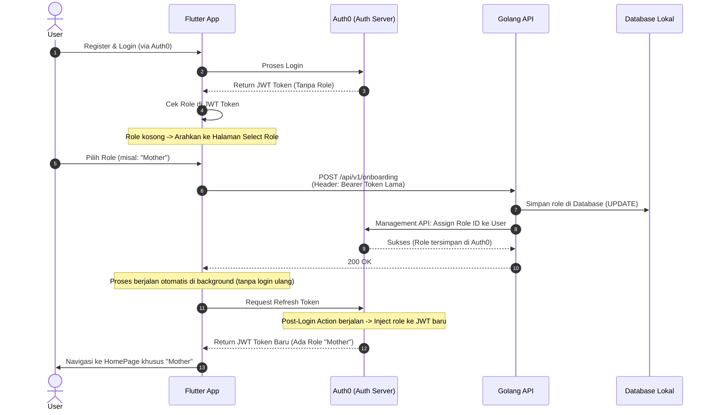

# Onboarding Auth Final

Dokumen ini menjelaskan alur final proses Autentikasi dan Onboarding (Pemilihan Role) pada aplikasi Nuzagizi yang mengintegrasikan Flutter, Golang, dan Auth0.

## Ringkasan Alur (The Flow)

```text
Register ➔ Login ➔ Cek Role ➔ Select Role ➔ Tembak API (/api/v1/onboarding) ➔ Simpan di DB & Auth0 ➔ Refresh JWT Token ➔ Masuk Halaman Utama (Home)
```

---

## Diagram Sekuensial



---

## Penjelasan Detail Per Langkah

1. **Register & Login:**
   Pengguna baru melakukan pendaftaran dan login melalui Auth0 (via Google Sign-In atau Email/Password).
2. **Cek Role (Splash / Auth Logic):**
   Aplikasi menerima *JWT Token* awal. Karena pengguna baru saja mendaftar, token ini belum memiliki *role*. Aplikasi mengecek hal ini dan mengarahkan pengguna ke halaman **Select Role (Onboarding)**.
3. **Select Role:**
   Pengguna memilih perannya (Ibu, Pengasuh, atau Dokter) dan mengisi data relevan lainnya.
4. **Tembak API (`/api/v1/onboarding`):**
   Aplikasi Flutter mengirimkan pilihan tersebut ke server Golang. Flutter juga menyertakan *JWT Token* lama agar backend tahu identitas pengguna yang sedang melakukan *request*.
5. **Role Disimpan (Auth0 & DB):**
   Server Golang melakukan dua hal:
   - Mencatat peran pengguna di *Database Lokal*.
   - Menghubungi *Auth0 Management API* untuk memberikan "Role ID" resmi ke akun pengguna di Auth0.
6. **JWT Token Mendapat Role:**
   Setelah mendapat balasan sukses dari Golang, Flutter memaksa pembaharuan token (*Refresh Token*) ke Auth0. Saat token baru dibuat, sistem Auth0 otomatis memasukkan (inject) status *role* pengguna ke dalam token tersebut.
7. **Masuk ke Halaman Utama (Home):**
   Flutter men-decode *JWT Token* yang baru didapat. Karena kini token tersebut sudah memuat *role*, aplikasi langsung mengarahkan pengguna ke halaman beranda (Home) yang sesuai, **tanpa perlu meminta pengguna login (memasukkan password) ulang**.
