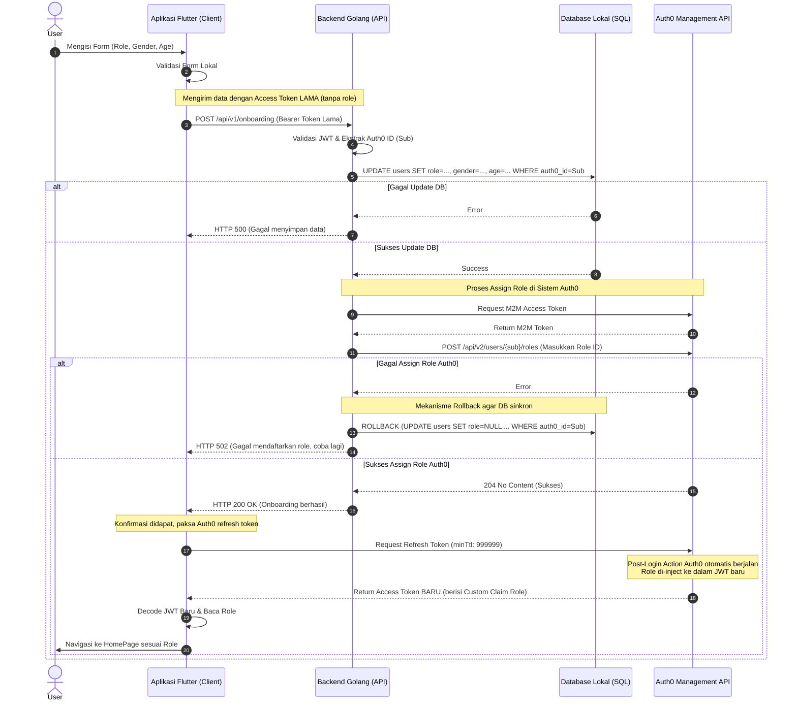

# Alur Onboarding (Pemilihan Role) - Nuzagizi

Berikut adalah diagram sekuensial (Sequence Diagram) yang memvisualisasikan bagaimana proses pemilihan *role* berjalan dari aplikasi Flutter, ke server Golang, hingga ke sistem keamanan Auth0.

### Keterangan Tambahan:
1. **Mekanisme Rollback**: Diagram di atas mengilustrasikan mengapa _rollback_ database penting. Jika Auth0 gagal merespons atau memproses, aplikasi mencegah _database_ lokal memiliki *role* sementara sistem autentikasi Auth0 tidak memilikinya.
2. **Post-Login Action**: Proses injeksi role ke dalam JWT tidak terjadi di Golang, melainkan terjadi secara otomatis di sistem Auth0 saat Flutter meminta penyegaran *(refresh)* token di langkah terakhir.
